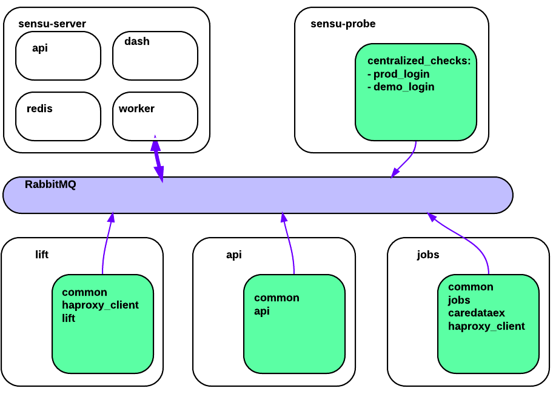
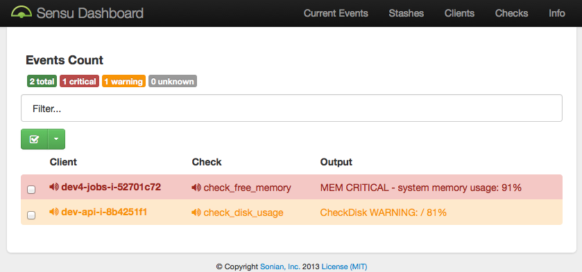

---
## Sensu & Self-service Monitoring

* Stratospheric view of architecture
* Introducing `sensu-runner`
* PhantomJS checks

---

--

---
## Introducting sensu-runner

    sensurun carbon-relay
    OK spawn_eight_carbons: PROCS OK: 8 processes with command name 'carbon-relay.py'
    OK carbon_listen_3004: TCP OK - 0.001 second response time on port 3004
    OK connect_carboncache_2014: TCP OK - 0.001 second response time on port 2014

Note: Idea: Supplement the server-driven, Chef-configured checks
with self-service check suites:

--
## Input format

`/etc/sensu/runners/carbon-relay`:

    checks:
      spawn_eight_carbons: 
        command: /usr/lib/nagios/plugins/check_procs -c 8:8 -C carbon-relay.py
      carbon_listen_3004: 
        command: /usr/lib/nagios/plugins/check_tcp -H localhost -p 3004
      connect_carboncache_2014: 
        command: /usr/lib/nagios/plugins/check_tcp -H carbon0.ops.audax.in -p 2014
    handlers:
      hipchat_yoloswag

--
## Subscriptions

Each Sensu client has a list of subscriptions, starting with _common_. In addition:

* chef-role (`lift`, `swagger`)
* chef-cookbook tags (`haproxy_client`)
 * e.g. `tag 'sensu:haproxy_client'` from zs-api::client

--
## Use Cases

* Interactive Use:
      sensurun carbon-relay
      OK spawn_eight_carbons: PROCS OK: 8 processes with command name 'carbon-relay.py'
* Development Sensu integration:
  * check, publish, aggregate, notify
* Prod Sensu integration

---
## Developing Checks

--

`brew install nagios-plugins`
`export PATH=$PATH:/usr/local/sbin/nagios-plugins`

--

- `check_procs -h`
- `check_tcp -h`
- `check_http -h`

Tip: check your own API for health/status

--
## Fill in the _____

api needs to check connectivity to rabbitmq-analytics,
but which one?

With Sensu tokenization:

--

/etc/sensu/conf.d/client.json:

    {
      "client": {
        "tokens": {
          "rabbitmq-analytics": {
            "url": "analyticsmq.infra.audax.in",
            "vhost": "rc"
          }
        }
      }
    }

--

/etc/sensu/runners/api:

    checks:
      check_rabbitmq-analytics_client:
        command: check_http -H :::tokens.rabbitmq-analytics.url::: \
          -p 15672 -u /api/aliveness-test/:::tokens.rabbitmq-analytics.vhost:::

--
## Getting rolling

`git clone git@github.com:AudaxHealthInc/sensurunner.git`

---

---
Note: This was supposed to be where I introduced you all 
to a bunch of Chef cookbook coding. 